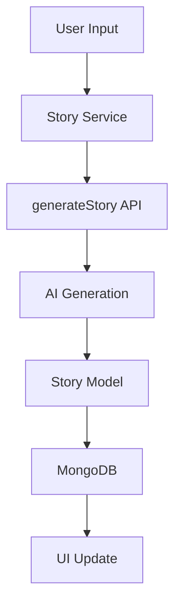
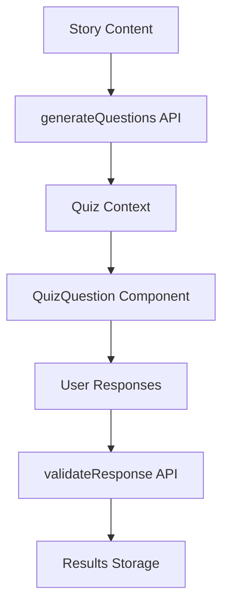
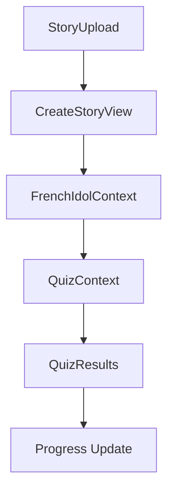

# System Patterns

## Architecture Overview

### Frontend Architecture

1. Next.js Framework

   - Pages-based routing
   - API routes for backend functionality
   - Server-side rendering capabilities
   - Static site generation where applicable

2. Component Structure
   ```
   src/
   ├── components/         # Feature-specific components
   ├── ui-kit/            # Reusable UI components
   ├── pages/             # Next.js pages
   ├── hooks/             # Custom React hooks
   ├── services/          # API service layers
   ├── models/            # Data models
   ├── types/             # TypeScript types
   └── lib/              # Utility functions
   ```

### Design Patterns

1. Component Patterns

   - Feature-based organization (french-idol, grade-levels, profile, results)
   - Context providers for state management (FrenchIdolContext, QuizContext)
   - Container/Presenter pattern
   - Composition over inheritance

2. Testing Patterns

   - Unit tests with Vitest
   - Component testing with React Testing Library
   - Mock implementations for external services
   - Test file co-location with implementation

3. State Management
   - React Context for feature-specific state
   - Custom hooks for shared logic (useDetermineQuestions, usePdfParser)
   - Service layer for API interactions (storyService, userService)
   - MongoDB models for data persistence

## Key Technical Patterns

### Story Generation Flow



### Quiz System



### French Idol Feature



## Component Relationships

### UI Components

1. Base Components (ui-kit/)

   - Button
   - TextInput
   - TextArea
   - Dropdown
   - Radio
   - Extensive icon library

2. Feature Components
   - Story Components (StoryInput, StoryList)
   - Quiz Components (QuizQuestion, QuizResults)
   - Profile Components (ProfileComponent)
   - Results Components (ResultsComponent, StoryQuizModal)
   - Grade Level Components (GradeLevelsTable)

### Service Layer

1. Data Services

   - storyService (story creation, retrieval)
   - userService (user management)
   - answerService (quiz responses)

2. API Integration
   - MongoDB connection (lib/mongodb.ts)
   - API routes for core functionality
   - Type-safe API responses

## Code Organization

### Directory Structure Patterns

1. Feature-based organization

   - Components grouped by feature
   - Co-located test files
   - Shared hooks and utilities
   - Type definitions per feature

2. Testing Structure
   - **tests** directories
   - **mocks** for external dependencies
   - Shared test utilities
   - Test setup configuration

### Data Flow Patterns

1. API Request Flow

   - Type-safe request/response cycle
   - Service layer abstraction
   - Error handling middleware
   - Response validation

2. State Management Flow
   - Context providers for feature state
   - Custom hooks for business logic
   - Service layer for data operations
   - Model layer for data structure

This system patterns documentation serves as a guide for maintaining consistency and understanding the technical architecture of the Bids AI platform.
